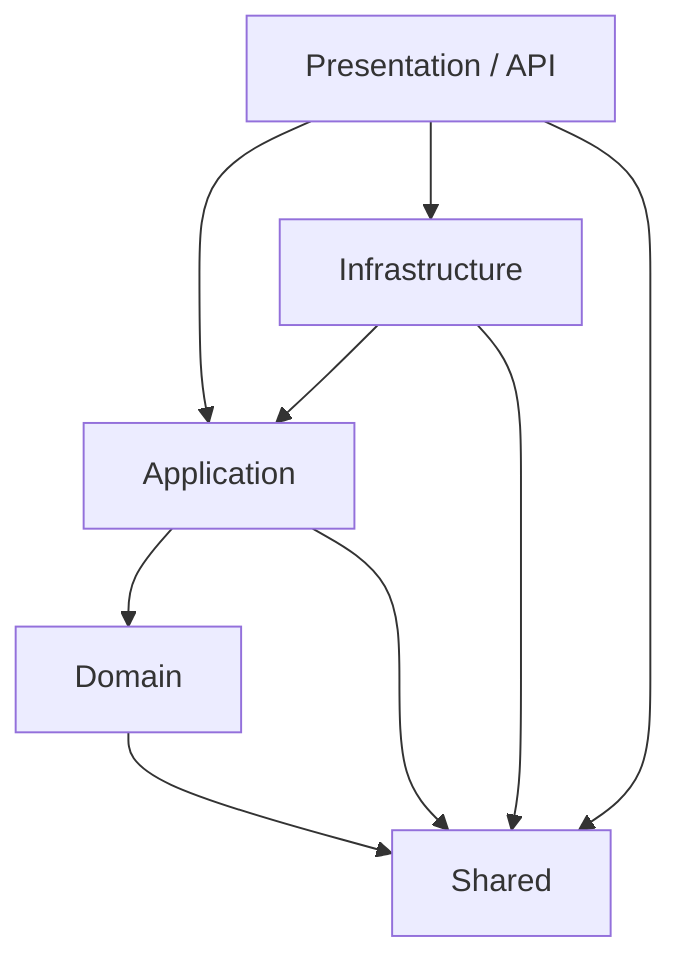

# Rule: Clean Architecture Layering and Dependency Flow

## Metadata
- **ID**: RULE-002-CLEAN-ARCHITECTURE
- **Scope**: Solution Architecture
- **Target Layers**: All
- **Status**: Active

## Overview
The solution strictly adheres to Clean Architecture principles. Dependencies flow inward toward the core Domain layer. External details (databases, APIs, security) reside in the outer layers.

---

## 1. Architectural Layers

### A. Domain Layer (`Blog.Domain`)
- **Purpose**: Core business model and rules.
- **Rules**:
  - Must have **zero dependencies** on other projects, except for `Blog.Shared`.
  - Must not reference external libraries (no Entity Framework, no ASP.NET Core, etc.).
  - Contains: Entities, Value Objects (if any), and Domain Validation.
  - Excludes: Repositories and external service interfaces (these are defined in Application).

### B. Application Layer (`Blog.Application`)
- **Purpose**: Application-specific business logic and orchestration.
- **Rules**:
  - References only `Blog.Domain` and `Blog.Shared`.
  - Contains: CQRS Command/Query models, Command/Query Handlers, DTO/Response types, and Repository Interfaces (`IUserRepository`, `IPostRepository`, `IUnitOfWork`).
  - No database-specific logic or HTTP controllers.

### C. Infrastructure Layer (`Blog.Infrastructure`)
- **Purpose**: External concerns and data access.
- **Rules**:
  - References `Blog.Application` and `Blog.Shared`.
  - Contains: DbContext implementations (`BlogDbContext`), EF configurations, migrations, repository implementations (`UserRepository`), Identity authentication services (`IdentityService`), and external mail delivery (`SmtpEmailService`).
  - Implements the interfaces defined in the Application layer.

### D. Presentation Layer (`Blog.Presentation`)
- **Purpose**: Entry point (HTTP API Web API).
- **Rules**:
  - References `Blog.Infrastructure`, `Blog.Application`, and `Blog.Shared`.
  - Acts as the Composition Root (Dependency Injection configuration in `Configurations/DependencyInjection.cs`).
  - Contains: API controllers, HTTP request DTOs, custom exception handling middleware, and OpenAPI/Scalar API Reference settings.

### E. Shared Layer (`Blog.Shared`)
- **Purpose**: Common primitives shared across all projects.
- **Rules**:
  - Must remain extremely light.
  - Contains: Result patterns (`Result`, `Result<TValue>`), basic Error definitions (`Error`, `ValidationError`).

---

## 2. strict Layering Enforcement
- **Cross-Layer Leakage**: Never pass database models (Entities) directly to client responses (Presentation). Always map to DTOs/Responses in the Application layer.
- **Infrastructure Abstractions**: Always use repository interfaces (`IPostRepository`) inside Use Cases. Never inject `BlogDbContext` directly into Application layer handlers.
