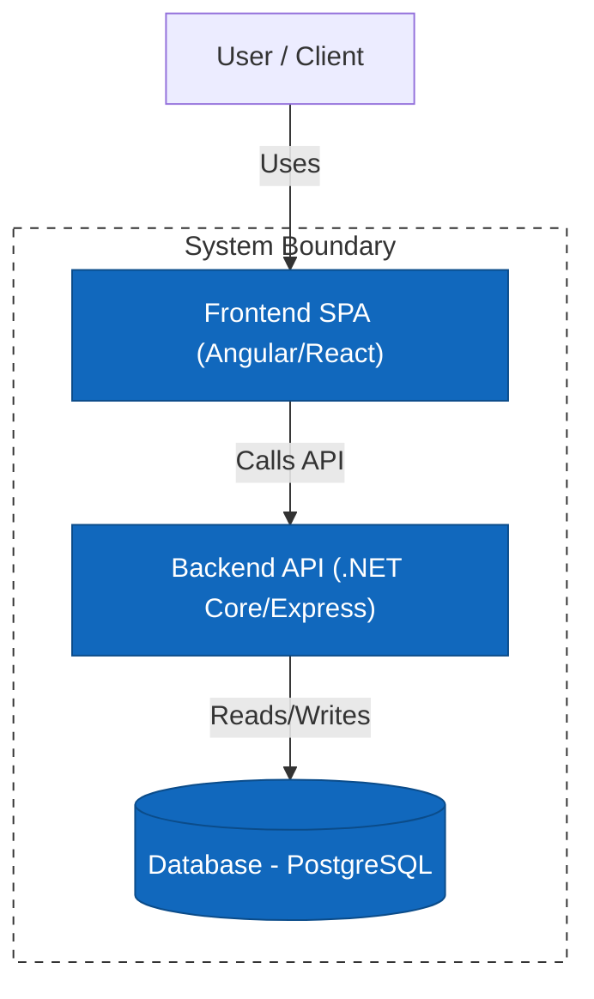
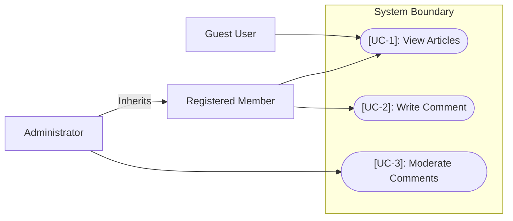
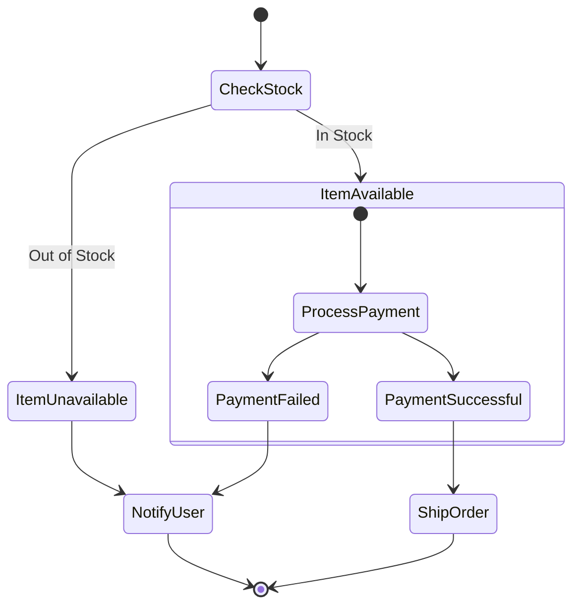
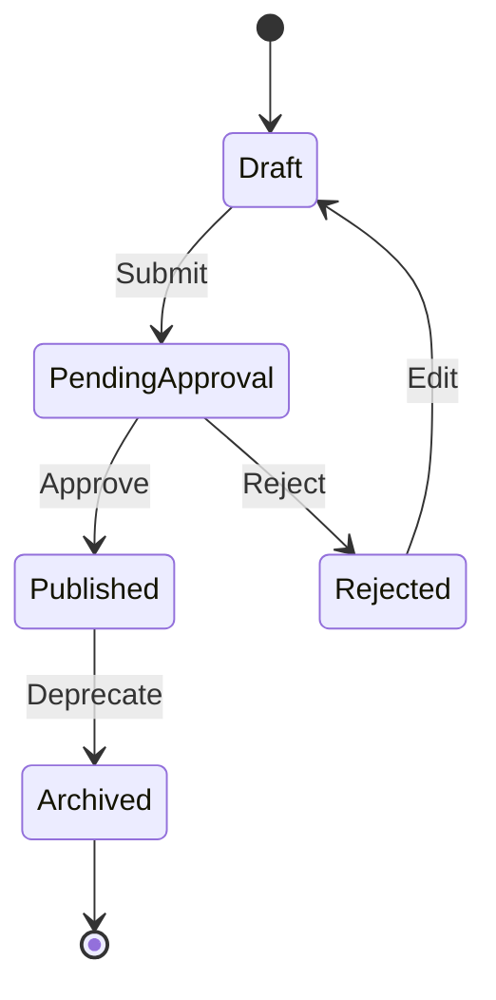
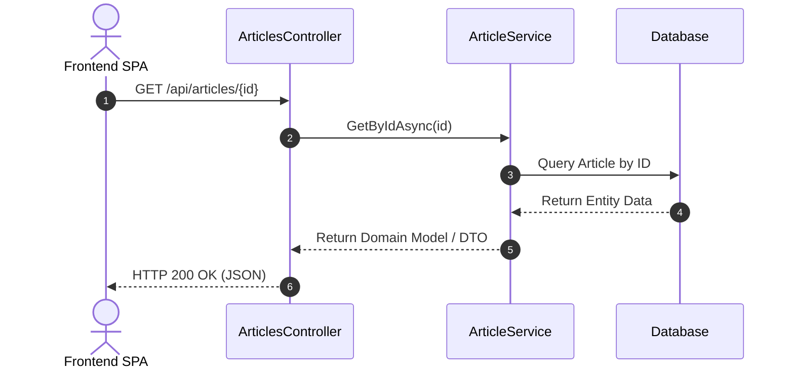
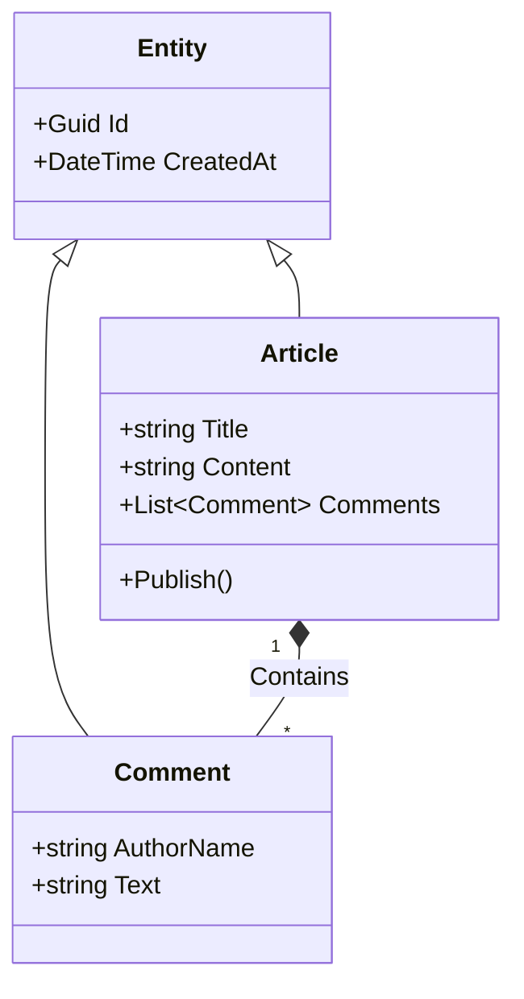

# Architecture Documentation & Diagramming Skill

This skill provides comprehensive guidelines for analyzing codebases, documenting system architecture, and generating C4 and UML diagrams using Mermaid.js syntax.

---

## 1. Documentation Structure & Location

Always recommend and implement the following folder structure at the project's root:

```text
docs/
├── README.md                  # Main entry point, high-level system overview
├── frontend/
│   └── README.md              # Frontend architecture, components, state, router
├── backend/
│   └── README.md              # Backend architecture, layer boundaries, data flow, APIs
└── diagrams/
    ├── c4/                    # C4 Model diagrams (.md files containing Mermaid blocks)
    ├── class/                 # Class diagrams (.md)
    ├── sequence/              # Sequence diagrams (.md)
    ├── state/                 # State/Lifecycle diagrams (.md)
    ├── activity/              # Activity/Workflow diagrams (.md)
    └── use-case/              # Use case diagrams (.md)
```

Generated markdown files in `docs/frontend/` and `docs/backend/` should dynamically reference and render the diagrams in `docs/diagrams/` via standard Markdown image/block embedding or link references.

---

## 2. Textual Specifications Alongside Diagrams

Every diagram should be accompanied by a **structured textual description** to bridge visual mapping with functional requirements.

### Use Case Diagrams Description Template
For every Use Case (`[UC-X]`) shown in the diagram, provide:
* **Identifier & Title**: `[UC-X]: [Name]` (e.g., `[UC-1]: View Articles`)
* **Actors**: Primary and secondary actors (e.g., `Registered User`, `Guest`)
* **Description**: A clear one-to-two sentence summary of the feature (e.g., `Any user, registered and unregistered, can read the articles from the project.`)
* **Pre-conditions**: (Optional) What must be true before this use case starts.
* **Post-conditions**: (Optional) What is true after the use case completes successfully.

### Activity/Workflow Description Template
For activity flows, explain:
* **Trigger**: What starts the activity.
* **Key Decisions**: Clear explanations of the branches (guards) in the flow.
* **Final State**: The outcome of the activity.

---

## 3. Diagram Guidelines & Mermaid Templates

### C4 Model Diagrams
C4 diagrams represent System Context (Level 1), Containers (Level 2), and Components (Level 3).

#### C4 Container Diagram Example


---

### Use Case Diagrams
Use case diagrams represent actors and their relationships to the system's actions.

> [!IMPORTANT]
> **Mermaid Use Case Syntax Constraints**:
> 1. Standard Mermaid does not natively support Use Case syntax (like `usecase` or `actor` keywords). You must always represent Use Case diagrams using **Flowchart** syntax (`flowchart LR`).
> 2. Represent the system boundary as a `subgraph`.
> 3. Represent use case actions as stadium/oval shape nodes (`UC1(["[UC-1]: Action"])`).
> 4. Respect and draw actor **Inheritance/Generalization** relationships using a standard flow connection pointing from the child actor to the parent actor (e.g., `Admin["Administrator"] -->|Inherits| Member["Registered Member"]`). This avoids redundant links from the child actor to the parent actor's use cases.

#### Mermaid Use Case Example


**Accompanying Text Example:**
* **[UC-1]: View Articles**: Any guest or registered member can read published articles.
* **[UC-2]: Write Comment**: Registered members can post comments under articles.
* **[UC-3]: Moderate Comments**: Administrators can approve or delete user comments.

---

### Activity Diagrams
Activity diagrams represent workflows and control flows step-by-step.

#### Mermaid Activity Example


---

### State Diagrams
State diagrams show the lifecycle states of an object.

#### Mermaid State Example


---

### Sequence Diagrams
Sequence diagrams capture runtime interactions between components or actors.

#### Mermaid Sequence Example


---

### Class Diagrams
Class diagrams show the structures of the system's classes, attributes, methods, and relationships.

#### Mermaid Class Example


---

## 4. Analysis Methodology

When tasked to document a project, perform the following steps:
1. **Directory Reconnaissance**: Run directory listing to detect where the frontend and backend live.
2. **Framework & Package Version Detection**: 
   - Inspect backend project files (e.g., `.csproj`, `build.gradle`, etc.) to identify languages, databases, web servers, and framework versions.
   - **MANDATORY**: Inspect the frontend configuration package file (`package.json`) to extract the exact frontend framework version (e.g. Angular, React, Vue version), instead of guessing or hardcoding.
3. **Core Scans & Auth Workflows**:
   - **Backend**: Find domain models/entities, controllers/handlers, database configurations, and dependency injectors.
   - **Frontend**: Find entry points, routing definitions, state stores, and base components.
   - **Authentication & Authorization**: Detect if the project implements an authentication/authorization mechanism (JWT, ASP.NET Core Identity, OAuth2, session-based cookies, refresh token rotation). If present:
     - Document this workflow in detail.
     - **MANDATORY**: Generate a **dedicated, standalone sequence diagram** (e.g. `docs/diagrams/sequence/auth_sequence_diagram.md`) specifically to clarify the login, token generation, and refresh token rotation flows, keeping it separate from user-registration workflows.
4. **Draft C4 Diagrams**: Establish Level 1 and Level 2 structures.
   - *Syntax Check*: Do not use parentheses inside flowchart transition labels (e.g., `-->|Reads / Writes (Entity Framework)|` is invalid and will throw a parse error; use quotes like `-->|"Reads / Writes (Entity Framework)"|` or plain text `-->|Reads / Writes via EF Core|` instead).
5. **Draft UML Diagrams**: Model critical use cases, activity flows, lifecycles, and database/class relations.
   - *Use Case Diagrams*: Always use `flowchart LR` syntax, using stadium shapes `([])` for use cases, and representing actor inheritance via labeled connectors `Child -->|Inherits| Parent`.
   - *Inheritance Syntax*: Do not use class diagram inheritance syntax (`<|--`) inside flowcharts (`graph TB`/`flowchart TB`). Use flowchart arrows (`-->`) or dashed lines (`-.->|Implements|`).
6. **Formulate Descriptions**: Provide detailed textual descriptions using IDs (like `[UC-1]`).
7. **Write and Structure**: Place all documents within the `docs/` hierarchy and provide a clean `docs/README.md` referencing everything.
